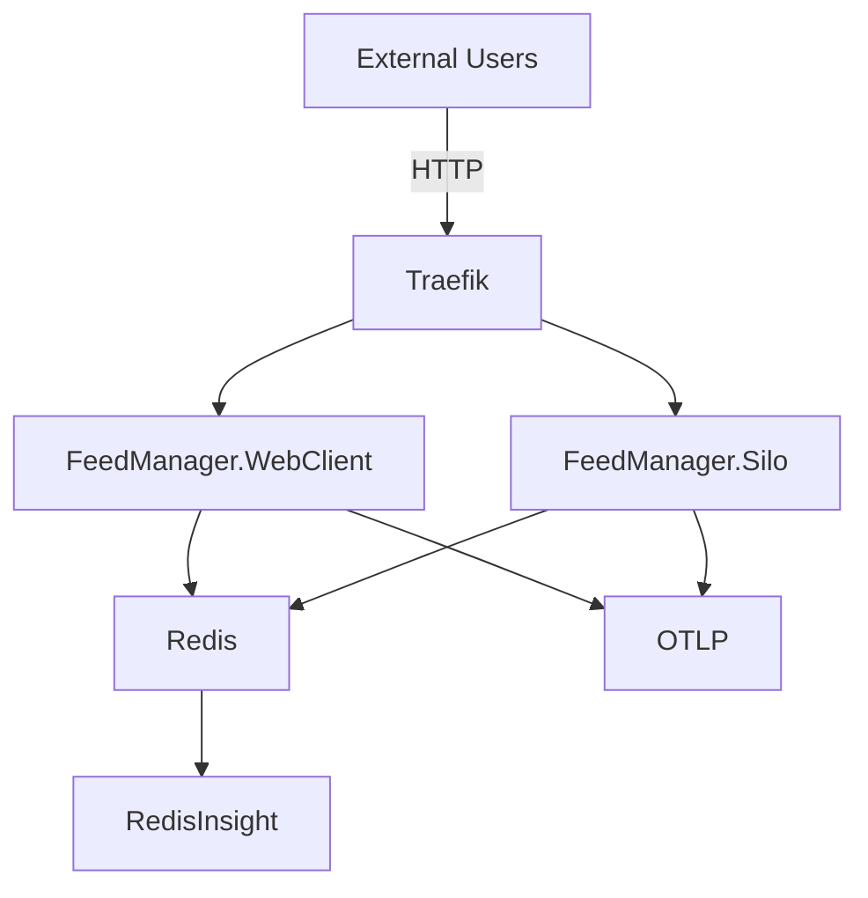

# FeedManager
A simple RSS feed manager / aggregator, similar to Feedly. This repository is an experimental playground for Orleans grains, a Razor Pages web client, and background services.

Current implementation highlights

- Orleans-based grains implement the feed aggregation and per-feed grains.
- Razor Pages web UI (FeedManager.WebClient) provides the user-facing frontend.
- Backchannel events use MassTransit with Redis as the message/transport used in the provided Docker Compose configuration.
- Redis is used for storage and as the message broker in the compose setup.
- Traefik is used as the reverse proxy / router for web traffic.
- OpenTelemetry (OTLP) is wired up for traces/metrics and exposed to the bundled OTLP/grafana image.
- RedisInsight is provided for inspecting the Redis instance.

Running with docker-compose

The repository includes a docker-compose.yml that starts the following services:

|Service|Description|
|-|-|
|feedmanager.silo      | Orleans silo (background processing)|
|feedmanager.webclient | Razor Pages web UI|
|redis                 | Redis (storage + message broker)|
|redisinsight          | RedisInsight UI|
|traefik               | Reverse proxy and dashboard|
|otlp                  | Grafana/LGTM image for all-in-one OpenTelemetry based telemetry|

Mermaid architecture diagram (based on docker-compose)

Notes

- The compose setup exposes services and connects them to the configured Docker network so Traefik can route traffic to the web UI and API endpoints.
- MassTransit consumers and publishers are registered in the app code; the compose file supplies Redis which is used as the transport when running locally via Docker.
- OpenTelemetry collector / Grafana (otlp image) is available on ports configured in docker-compose for easy inspection of traces/metrics.

